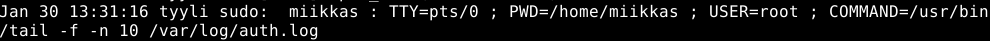
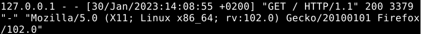
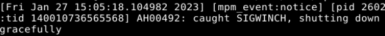
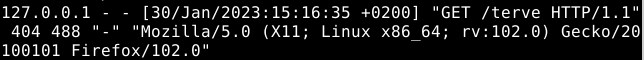

# h4 Tehtävä

## Kone 
- MacBook Air(2015)
- Intel i5 1,6 GHz Dual-Core prossu
- 8 GB RAM
- macOS Monterey v.12.6.2

## x) 

### Toybox: All-in-one Linux command line

- Artikkelissa linkki Toybox nimisen command line ohjelman githubiin.
- Ohjelma on vapaan lisenssin ohjelma.(BSD Zero Clause License, joka sallii ohjelman vapaan käytön mihin tahansa käyttötarkoitukseen.)
- Ohjelmaa on kuvattu seuraavasti Githubissa: 
    
      "The toybox build produces a multicall binary, a "swiss-army-knife" program
      that acts differently depending on the name it was called by (cp, mv, cat...).
      Installing toybox adds symlinks for each command name to the $PATH."
 
Tutustuin vielä hieman tarkemmin multicall binary menetelmään, jota Toybox käyttää. 
 
"Multicall binary" on siis ajotiedosto, joka suorittaa koodia sen kutsumiseen käytetyn nimen mukaan. Tämä yleensä tuo paketin asentamaan yhden ajotiedoston ja sitten sarjan symbolisia linkkejä eri vaihtoehtoisilla nimillä, jotka johtavat toiseen ajotiedostoon.

- Githubissa esittelyssä myös kerrotaan ohjelman erityisestä "toybox" komennosta, joka käsittelee ensimmäistä annettua argumenttia suoritettavana komentona. Ilman argumentteja ohjelma luettelee käytettävissä olevat komennot.

- Hacker News artikkelin kommenteissa ohjelma saa osakseen varsin paljon kritiikkiä. Ohjelma sai kritiikkiä erityisesti dokumentoinnin puutteesta. Käyttäjät olisivat selkeästi kaivanneet tarkempaan dokumentointia ohjelmasta sekä sen tekemisestä pelkän koodin sijaan.
- Ohjelmaa myös verrattiin ilmeisesti hyvin samankaltaiseen ohjelmaan nimeltä Busybox.
- Kommenteissa käytiin myös keskustelua Toybox ohjelman lisenssistä, sekä muiden samankaltaisten ohjelmien lisensseistö.
- Myös ohjelman komentojen kehittämisestä sekä ohjelman ominaisuuksista oli kommentointu rakentavasti.

## a) Tukki. Analysoi yksi esimerkkirivi kustakin näistä lokeista

### /var/log/syslog 

Syötin komentokehotteeseen ``$ sudo tail -f -n 10 /var/log/syslog``, jotta sain 10 viimeisintä tapahtumaa lokista.
Valitsin riveistä seuraavan.

- Rivillä näkyy aikaleima, joka pitää paikkansa, virtuaalikoneeni tunniste eli tässä tapauksessa ``tyyli``. 
- Rivi kertoo viestillä tapahtuman ``Started Virtual filesystem metadata service.`` Tämä kertoo, että virtuaalisen tiedostojärjestelmän metadata toiminto/palvelu on käynnistetty.
Tunnisteen ``tyyli`` jälkeen rivillä on ``systemd[1178]`` itselleni tämä ei rehellisesti sano juuri mitään, joten päätin etsiä tietoa internetistä. 
- Olettaisin, että tässä tapauksessa systemd tarjoaa sen komponentin kirjaaman viestin. Voisiko numero ``[1178]`` olla tunniste komponentin tarjoamalle viestille, joka tulostetaan systemd:n jälkeen komentokehotteeseen.  

### /var/log/auth.log 

Lokiin on kirjautunut sudon käyttö, kun avasin ``/var/log/auth.log.`` Aikaleima pitää paikkansa. Aikaleiman jälkeen on virtuaalikoneeni tunniste ``tyyli``. ``sudo: miikkas`` kertoo, että käyttäjäni ``miikkas`` on käyttänyt sudo komentoa. ``PWD=/home/miikkas`` kertoo hakemiston. ``USER=root``kertoo, että käyttäjä on pääkäyttäjä eli root. Sen jälkeen rivillä on ``COMMAND=/usr/bin/tail -f -n 10 /var/log/auth.log``. Tämä kertoo komennon, joka sudolla on suoritettu.

``TTY=pts/0`` Ei ole kovin tuttu osa. Selvitin, että ilmeisesti ``TTY`` on natiivi päätelaite, jolla on suora pääsy laitteeseen ja ``pts/0`` eli Pseudo-terminal slave olisi vastaava orjatiedosto. Tämä osa jäi kuitenkin silti edelleen jokseenkin epäselväksi.

### /var/log/apache2/access.log 

Rivi kertoo, että apache2 localhost palvelimelle on tehty ``GET`` pyyntö ``/HTTP/1.1`` osoitteeseen. Rivillä näkyy mistä pyyntö on tehty(ip osoite ``127.0.0.1``), aikaleima joka sisältää aikavyöhykkeen, joka pitää paikkansa. Tiedän, että aikaleima on oikein, sillä olen itse tehnyt tämän pyynnön. Numero ``200`` kertoo onnistuneesta surffailusta palvelimella ja ``3379`` kertoo käyttäjälle tarjotun paketin koon. 

Rivin loppuosa ``"Mozilla/5.0 (X11; Linux x86_64; rv:102.0) Gecko/20100101 Firefox/102.0"`` kertoo informaatiota selaimesta, jota pyynnön tehnyt käyttäjä käyttää palvelimelle pääsemiseen.

Mielestäni riviltä jäi puuttumaan ip osoitteen jälkeen käyttäjän tunniste. ``127.0.0.1 - - [...`` Tunnisteen tilalla on pelkkä ``"-"``. En tiedä syytä tälle. Myös paketin koon ja rivin loppuosan välissä on ``"-"``, jossa ilmeisesti pitäisi olla HTTP viittaus, joka edustaa osotetta, josta pyyntö on peräisin. Esim ``"http://localhost/"``.

### /var/log/apache2/error.log

Löysin apache2 error lokista yllä olevan rivin. Tunnistin rivistä aikaleiman, sekä oletin, että shutting down gracefully viittaisi jotenkin siihen, että apache2 palvelin on sulkeutunut jonkin errorin vuoksi. ``[mpm_event:notice]`` kertoo virheen tasosta. ``notice`` viittaa siihen, että virhe olisi normaali, mutta olosuhteet ovat merkitykselliset(Normal, but significant conditions).

Selvitin, että ilmeisesti, kun systemd pysäyttää Apache palvelimen ``graceful-stop``, tämä generoi ``SIGWINCH`` signaalin ja lokiin kirjautuu error ``caught SIGWINCH, shutting down gracefully.`` Suoranaista selitystä en errorille löytänyt. 
Katsoin lokia, mutta tuohon aikaleimaan/lähellä sitä ei ollut muita erroreita. Rivi voisi mahdollisesti viitata siihen, että palvelimen sulkemisen yhteydessä on tullut joku virhe. 

## b)

### Onnistunut:

Onnistunut lokimerkintä selailusta Apache2 palvelimella. Merkinnässä ``200`` kertoo, että verkkoselailu on onnistunut. Merkinnässä on minun ip osoite, pitäisi olla käyttäjän tunniste, mutta jostain syystä siinä on ``-``,  aikaleima ja aikavyöhyke. "GET / pyyntö HTTP/1.1:lle", ``3380`` on pyydetyn paketin koko ja rivin loppuosa on pyynnön tehneen käyttäjän verkkoselaimen tietoja.

### Epäonnistunut:

Lokimerkinnässä on tehty ip osoitteesta ``127.0.0.1``, käyttäjä ``-``, aikaleimalla ``[30/Jan/2023:15:16:35 +0200]`` ``GET`` pyynnön ``/terve`` päätteeseen ``HTTP/1.1``:lle. Lokimerkinnässä kuitenkin näkyy, että palvelin vastasi virheellä ``404`` ja ``488``. ``4...``alkuinen numerosarja viittaa palvelimen virheeseen. Lokimerkinnän loppuosa kertoo pyynnön tehneen käyttäjän verkkoselaimen tietoja.

## Lähteet

Toybox: All-in-one Linux comman line, Luettavissa: https://news.ycombinator.com/item?id=28627433
Toybox Github: https://github.com/landley/toybox
Multicall binaries, Diego Elio Pettenò 2004 Luettavissa: https://flameeyes.blog/2009/10/19/multicall-binaries/
Apache error log explained, luettavissa: https://stackify.com/apache-error-log-explained/
Understanding the Apache Access Log: View, Locate and Analyze, luettavissa: https://www.sumologic.com/blog/apache-access-log/
